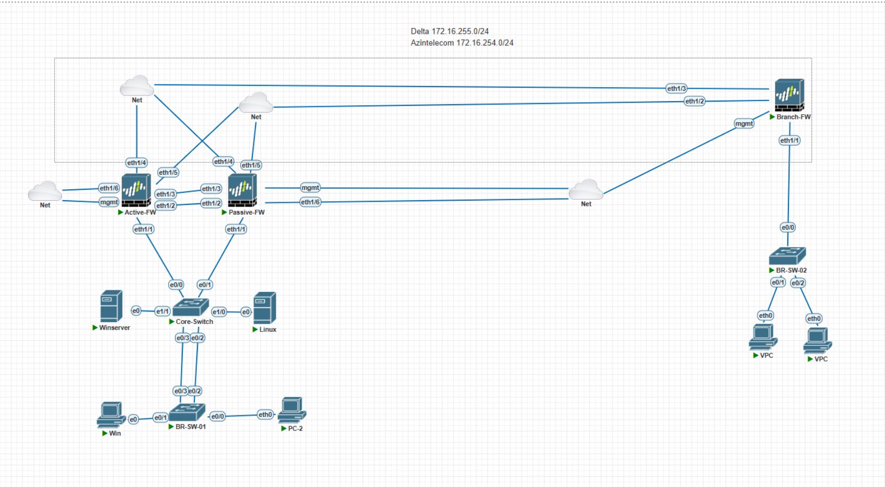

# Secure Corporate IT Infrastructure with Centralized Monitoring

## Professional Summary

Enterprise-level secure IT infrastructure project demonstrating High Availability firewall deployment, IPSec VPN architecture, centralized SIEM monitoring, Active Directory hardening, patch management, and VLAN-based network segmentation within a hybrid Windows/Linux environment.

---

## Project Overview

This diploma project demonstrates the design and implementation of a secure enterprise IT infrastructure with centralized monitoring, high availability, and layered security controls across multiple network segments and branch offices.

---

## Network Architecture

- Palo Alto Firewall (Active/Passive High Availability)
- IPSec VPN tunnels between headquarters and branch offices
- VLAN-based network segmentation
- Core & Branch switches (EtherChannel, trunking)
- DHCP configuration
- Hybrid Windows & Linux infrastructure

---

## Security Implementation

- IPSec VPN with IKE & Crypto profiles
- Centralized log collection via Wazuh SIEM (Syslog integration)
- Infrastructure monitoring with Zabbix
- Active Directory domain deployment
- LAPS implementation for local administrator password rotation
- Fine-Grained Password Policies (FGPP)
- Patch management via ManageEngine Desktop Central

---

## Additional Enterprise Services

- Nextcloud (Private Cloud Deployment)
- Mattermost with LDAP integration
- 3CX IP Telephony
- Automated backup of network device configurations

---

## High Availability Design

- Active/Passive Palo Alto HA cluster
- HA1 and HA2 synchronization
- Link and path monitoring
- Automatic failover mechanism
- Resilient branch-to-headquarters connectivity

---

## Security Hardening Measures

- Network segmentation using VLANs
- Controlled inter-zone firewall policies
- Encrypted site-to-site VPN communication
- Centralized monitoring and alerting
- Password complexity enforcement
- Endpoint patching and vulnerability mitigation
- Administrative privilege protection via LAPS

---

## Technical Highlights

- Deployed enterprise-grade firewall HA cluster
- Designed secure site-to-site VPN architecture
- Implemented centralized SIEM logging
- Hardened Active Directory environment
- Integrated Linux systems into AD domain
- Designed monitoring and patch management workflow
- Implemented failover and redundancy mechanisms

---

## Architecture Diagram

---

## Author

**Inal Hajizada**  
STEP IT Academy

## Project Presentation

[Download Presentation](Secure-Corporate-IT-Infrastructure-Diploma.pdf)
